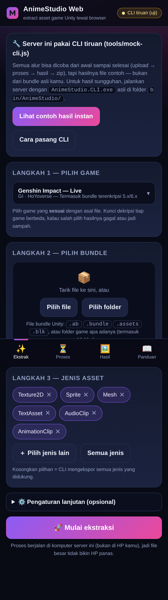
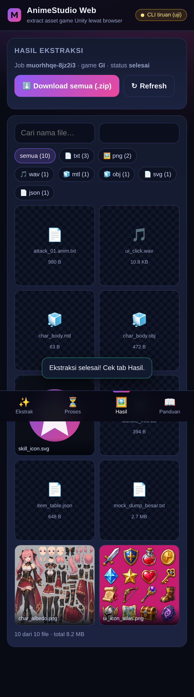

# AnimeStudio Web 🎮📱

Tampilan **web (mobile friendly)** untuk [**AnimeStudio**](https://github.com/Escartem/AnimeStudio) —
tool ekstraksi asset game Unity buatan **Escartem** (fork dari *Studio* oleh Razmoth dan *AssetStudio* oleh Perfare).

Intinya: AnimeStudio itu aplikasi desktop Windows. Project ini membungkusnya jadi server web kecil,
jadi kamu bisa **upload bundle → proses → lihat & download hasilnya langsung dari browser HP**.

| Di HP | Hasil ekstraksi |
| --- | --- |
|  |  |

---

## ✨ Fitur

- **Alur 3 langkah** — pilih game → pilih file/folder → mulai ekstraksi (dirancang untuk layar HP, tombol besar).
- **Upload folder** beserta subfolder (drag & drop atau pemilih folder), progress per file.
- **Pemilih game lengkap** — 74 entri: Genshin Impact, Star Rail, ZZZ, Honkai 3rd, Tears of Themis, Arknights, Reverse: 1999, PGR, dan puluhan game Unity lain + semua key **Unity CN** bawaan.
- **Pemilih jenis asset** — 539 nama `ClassIDType` Unity + preset cepat (Gambar & sprite, Audio, Model 3D, Animasi, Teks & data).
- **Pengaturan lanjutan lengkap** — `--export_type`, `--group_assets`, `--names`, `--containers`, `--unity_version`, `--map_op/--map_type/--map_name`, `--key`, `--ai_file`, `--dummy_dlls`, `--silent`.
- **Log real-time** (Server-Sent Events) — perintah CLI yang dipakai, progress `[12/340] Exporting …`, error, semuanya terlihat.
- **Galeri hasil** — pratinjau gambar langsung di browser, pemutar audio/video, pratinjau teks/json/obj, pencarian nama, filter per jenis file.
- **Download per file** atau **semua sekaligus sebagai `.zip`** (ditulis streaming di server, mendukung ZIP64 untuk hasil > 4 GB).
- **Tombol batal & hapus job**, riwayat job, hapus massal.
- **Zero dependensi** — cuma butuh Node.js 18+. Gak ada `npm install`, gak ada `node_modules`.
- **Mode demo** — kalau binary CLI belum ada, UI-nya tetap bisa dicoba penuh pakai hasil contoh.
- **CLI tiruan ikut disertakan** (`tools/mock-cli.js`) untuk menguji seluruh alur tanpa Windows.

---

## 🚀 Menjalankan

### Yang kamu butuhkan

1. **Node.js 18+** → <https://nodejs.org> (pilih LTS). *Ini saja yang wajib.*
2. **AnimeStudio.CLI** (Windows x64, butuh .NET Desktop Runtime):
   - [Build .NET 10 — terbaru](https://nightly.link/Escartem/AnimeStudio/workflows/build/master/AnimeStudio-net10.zip)
   - [Build .NET 9 — stabil](https://nightly.link/Escartem/AnimeStudio/workflows/build/master/AnimeStudio-net9.zip)

### Windows

```
1. Ekstrak isi AnimeStudio-net10.zip ke folder  animestudio-web\bin\AnimeStudio\
   (harus ada file  bin\AnimeStudio\AnimeStudio.CLI.exe )
2. Dobel klik  run-windows.bat
3. Browser terbuka otomatis di  http://localhost:8787
```

Kalau Windows Firewall nanya, pilih **Allow** supaya HP di wifi yang sama bisa nyambung.

### 🅱️ Tidak punya PC sama sekali? → pakai GitHub Actions

Folder **`../github-extract/`** berisi template repo GitHub (workflow `AnimeStudio Extract`) yang menjalankan
AnimeStudio di **runner Windows gratis milik GitHub**. Semua bisa dilakukan dari browser HP: upload bundle ke
Releases → tekan *Run workflow* → unduh hasilnya. Cocok kalau cara A di atas tidak mungkin (tidak ada PC/VPS).
Minimal: repo **private**, kode game (mis. `GI`), dan link file bundle.

| | Cara A — server web ini | Cara B — GitHub Actions |
| --- | --- | --- |
| Butuh | Node.js + CLI di PC/VPS Windows | akun GitHub |
| Mesin | milikmu | runner Windows 2 core/8 GB (private repo) |
| Batas file | sebesar disk kamu | 2 GB per file release, disk 14 GB |
| Enak untuk | banyak kali, pratinjau & zip sekali klik | sesekali, tanpa PC |
| Biaya | gratis | gratis (kuota 2.000 menit/bulan, Windows ×2) |

### Linux / macOS / Termux

```bash
mkdir -p bin/AnimeStudio        # taruh AnimeStudio.CLI di sini (kalau ada)
chmod +x run.sh && ./run.sh
# atau langsung: node server.js
```

### Uji coba tanpa CLI (mode tiruan)

```bash
AS_CLI="node tools/mock-cli.js" node server.js
```

Semua alur berfungsi end-to-end, hanya hasilnya file contoh.

---

## 📱 Pakai dari HP (tanpa punya PC)

AnimeStudio yang asli **Windows x64**, jadi HP-nya dipakai sebagai remote control dan "otak"-nya
tetap harus jalan di suatu tempat Windows. Urutan dari yang paling gampang:

| Cara | Bagaimana |
| --- | --- |
| **Titip jalan di PC** (punya sendiri / teman / warnet) | jalankan `run-windows.bat` di PC itu, lalu buka `http://IP-PC:8787` di browser HP yang tersambung wifi sama. Alamat LAN-nya dicetak saat server start. |
| **Cloud PC / VPS Windows** | install Node.js + taruh CLI di server, jalankan, akses dari HP lewat browser. Cocok untuk jangka panjang & folder game besar. |
| **Android + Termux** | eksperimental: CLI-nya .NET Windows, jadi butuh Wine/Box86-ARM — sering gagal dan lambat. Web-nya sendiri jalan mulus di Termux (`pkg install nodejs-lts && ./run.sh`). |
| **Minta bantuan komunitas** | [Discord AnimeStudio](https://discord.gg/fzRdtVh) — banyak yang sudah punya setup dan mau bantu ekstrak. |

> Catatan jujur: ekstraksi folder game besar (puluhan GB) realistis butuh PC/VPS. HP-nya tetap nyaman
> untuk upload, memantau progress, cari asset, memilih file, dan download hasil — proses beratnya bukan di browser.

---

## ⚙️ Konfigurasi (environment variable)

| Variabel | Default | Fungsi |
| --- | --- | --- |
| `PORT` | `8787` | Port server |
| `HOST` | `0.0.0.0` | Interface server (biar bisa diakses dari HP) |
| `AS_CLI` | – | Path/perintah CLI manual, mis. `AS_CLI="D:\AnimeStudio.CLI.exe"` atau `AS_CLI="node tools/mock-cli.js"` |
| `AS_CLI_DIR` | `bin/AnimeStudio` | Folder pencarian `AnimeStudio.CLI.exe` (subfolder juga dipindai) |
| `AS_DATA_DIR` | `data/` | Lokasi upload, output, log, dan zip job |

Contoh:

```bash
PORT=9000 AS_CLI="/opt/AnimeStudio/AnimeStudio.CLI.exe" node server.js
```

---

## 🧭 Struktur & cara kerja

```
animestudio-web/
├── server.js            # HTTP server + semua endpoint API (Node stdlib, tanpa framework)
├── src/
│   ├── config.js        # konfigurasi + deteksi otomatis binary CLI
│   ├── jobs.js          # manajemen job: upload, spawn CLI, parse log/progress, scan hasil, zip
│   ├── zip.js           # penulis ZIP streaming (STORE + ZIP64), buatan sendiri
│   ├── crc32.js         # CRC-32 inkremental untuk zip
│   ├── util.js          # helper mime/path/body (termasuk proteksi path traversal)
│   └── data/            # games.json (74 entri) + classids.json (539 ClassIDType)
├── public/              # UI: index.html, style.css, app.js, icon.svg (vanilla, tanpa CDN)
├── demo/                # asset contoh untuk mode demo
├── tools/mock-cli.js    # CLI tiruan untuk uji alur
├── bin/AnimeStudio/     # ← taruh AnimeStudio.CLI.exe di sini
└── data/jobs/<id>/      # input/ output/ log.txt bundle.zip job.json
```

Perintah yang dijalankan server (persis seperti pakai CLI manual):

```
AnimeStudio.CLI.exe <data/jobs/<id>/input> <data/jobs/<id>/output> \
  --game GI --types Texture2D,Sprite --export_type Convert --group_assets ByType
```

Progress & log diambil dari stdout CLI lalu dikirim ke browser via SSE.

---

## 🔌 Ringkasan API

| Method & path | Fungsi |
| --- | --- |
| `GET /api/state` | Status server, status CLI, daftar job |
| `GET /api/catalog` | Daftar game & ClassIDType |
| `POST /api/jobs` | Buat job baru (opsi ekspor) |
| `PUT /api/jobs/:id/file?path=…` | Upload satu file (body mentah, path relatif aman) |
| `POST /api/jobs/:id/run` \| `/cancel` | Jalankan / batalkan |
| `GET /api/jobs/:id/events` | SSE: log, progress, status, progress zip |
| `GET /api/jobs/:id/results` | Daftar file hasil (+filter `q`, `ext`) |
| `GET /api/jobs/:id/file?path=…&download=1` | Ambil satu file (mendukung HTTP Range) |
| `POST/GET/DELETE /api/jobs/:id/zip` | Buat / unduh / hapus arsip zip |
| `DELETE /api/jobs/:id` | Hapus job + semua filenya |
| `POST /api/demo` | Buat job contoh (mode demo) |

---

## 🔐 Keamanan

Server ini **tanpa autentikasi** dan bisa menulis/menghapus file di bawah `data/`, jadi:

- jalankan hanya di **jaringan lokal/PC sendiri**, jangan diekspos langsung ke internet;
- kalau perlu akses dari luar, taruh di belakang reverse proxy + password (mis. Caddy/Nginx basic auth);
- server memblokir path traversal (semua path relatif disanitasi dan dikurung ke folder job);
- folder `bin/`, `data/`, dan `demo/` tidak pernah disajikan sebagai file statis.

---

## ❓ Kalau ada masalah

| Gejala | Solusi |
| --- | --- |
| Badge kanan atas “belum ada CLI” | pastikan `bin/AnimeStudio/AnimeStudio.CLI.exe` ada, atau jalankan dengan `AS_CLI=…`. Muat ulang halaman. |
| “Invalid Game” / hasil sampah | salah pilih entri game — coba entri lain (mis. `GI` vs `GI_CB3`) atau isi versi Unity. |
| 0 file / folder output kosong | filter jenis asset/nama terlalu ketat → klin “Semua jenis” dan kosongkan regex. |
| Error `MeshRenderer`/`SkinnedMeshRenderer` | batasi jenis asset ke `Mesh`/`Texture2D` saja, atau ambil teksturnya dulu. |
| Upload file > 2 GB putus dari HP | pecah jadi beberapa batch, atau salin langsung ke `data/jobs/<id>/input/` di komputer server. |
| Zip gagal | pastikan ruang disk cukup (zip perlu ~1× ukuran hasil). |
| Terminal .NET runtime error | install [.NET Desktop Runtime](https://dotnet.microsoft.com/download/dotnet) yang cocok dengan build (9 atau 10). |

---

## 🤝 Kredit & lisensi

- **[AnimeStudio](https://github.com/Escartem/AnimeStudio)** oleh **Escartem** dan para kontributor — lisensi **MIT**. Semua pekerjaan berat (dekripsi, parsing, ekspor) dikerjakan oleh project ini.
- Berdiri di atas **[Studio](https://github.com/RazTools/Studio)** (Razmoth) dan **[AssetStudio](https://github.com/Perfare/AssetStudio)** (Perfare).
- Wrapper web ini bebas kamu pakai, ubah, dan sebarkan (MIT juga).

**Etika:** ekstrak asset hanya untuk pemakaian pribadi (mod, fanart, riset, belajar). Jangan menyebarkan
file mentah milik game atau memakainya secara komersial tanpa izin publisher, dan jangan sebarkan
key dekripsi ke pihak yang tidak berkepentingan.
